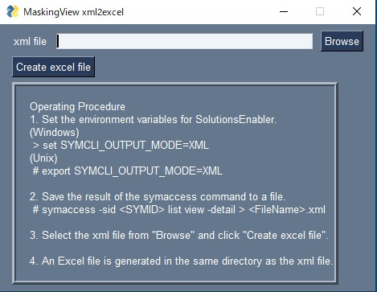

# pmax_acl_xml2excel
This tool converts PowerMax/VMAX MaskingView output results to an Excel file.  
  
Note 
* StorageGroup and SymDev in the Excel file do not display the same row by row.
* InitiatorGroup assumes that consistent_lun is enabled.

---
### Operating Procedure
```
1. Set the environment variables for SolutionsEnabler.
(Windows)
 > set SYMCLI_OUTPUT_MODE=XML
(Unix)
 # export SYMCLI_OUTPUT_MODE=XML

2. Save the result of the symaccess command to a file.
 # symaccess -sid <SYMID> list view -detail > <FileName>.xml

3. Launch acl_xml2excel_vXX.XX.exe

4. Select the xml file from "Browse" and click "Create excel file".

5. An Excel file is generated in the same directory as the xml file.
```
---
### Download
You can download the converted file to exe in pyinstaller for Windows 10 (64bit).  
After unzipping, run acl_xml2excel_vXX.XX.exe.  

[acl_xml2excel_v00.02.zip](https://github.com/ss95089/pmax_acl_xml2excel/raw/main/dist/acl_xml2excel_v00.02.zip)  

---
### Screenshot


---
### Development environment
Python 3.8.9  
